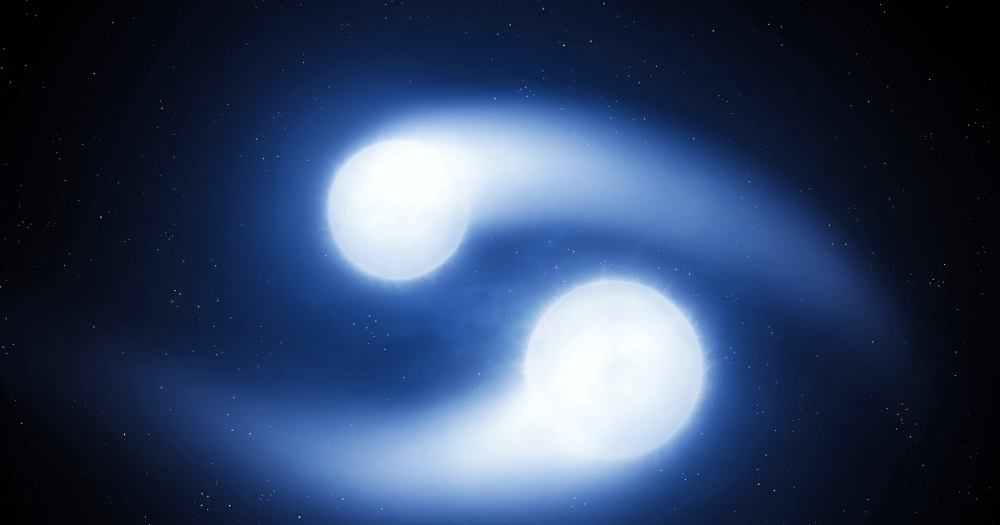

# Binary-Star-Gravity-Sandbox
I started this project as a basic 2D gravity simulation, inspired by this [Youtube](https://youtu.be/WTLPmUHTPqo?si=G-4t037JenLN4RRD) Tutorial.
 
But i ended up having too much fun with it. I extended it into a binary-star system, where two massive bodies orbit each other and how it affects the surrounding planets.
 

 
This simulation uses Euler integration and is not the most scienticfically accurate.
 
It's meant as a gravity sandbox to experiment with how a two-star system behaves and how planets respond to chaotic gravitational fields.
 
### Features
- 2D Newtonian gravity simulation
- Binary star system with orbiting suns
- Planetary motion influenced by multiple massive bodies
- Adjustable parsmeters for experimentation
